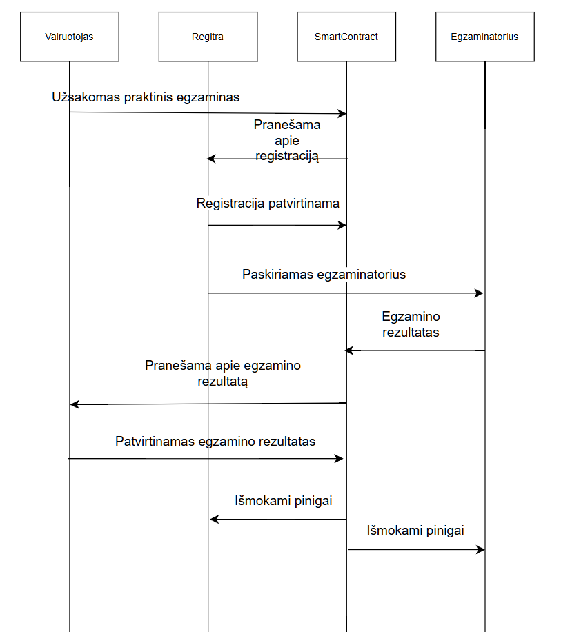

## Blockchain 4 darbas

Šiame verslo modelyje dalyvauja tokios šalys: pirkėjas, pardavėjas, kurjeris, o pati išmanioji sutartis užtikrina "saugų" prekių pardavimą/pirkimą ir pristatymą.

Verslo modelis: Business-to-Business (B2B)

* Mažmenininkas užsako prekes iš gamintojo. Gamintojas patikrina prekių kiekį, surenka produktus, supakuoja, paruošia ir išsiunčia. Mažmenininkas ir gamintojas turi patikimą komercinį santykį.
* Siuntimą atlieka kurjeris, kurį užsako gamintojas, ir jie taip pat turi patikimą komercinį santykį.
* Patikimas komercinis santykis tarp mažmenininko ir kurjerio yra tranzityvus dėl bendro santykio su gamintoju.
* Patikimas komercinis santykis yra labai svarbus, nes tradicinėje rinkoje tai būtina. Mokėjimas iš mažmenininko gamintojui įvyksta praėjus kelioms dienoms po prekių gavimo. Ir mokėjimas iš gamintojo kurjeriui įvyksta praėjus kelioms dienoms po pristatymo patvirtinimo. Jei nebūtų pasitikėjimo, jie nepasitikėtų vieni kitais ir nesudarytų sandorių. Tai neskatina konkurencijos dėl geriausių kainų, paslaugų ir produktų.

*Verslo modelio schema, rodanti pirkėjo, pardavėjo ir kurjerio sąveiką išmaniojoje sutartyje*

Išmaniosios sutarties pagrindinės funkcijos:

Pirkimo-pardavimo proceso valdymas

Užtikrinti saugų mokėjimą
Kontroliuoti prekių būseną
Automatizuoti atsiskaitymus tarp dalyvių

Pagrindiniai žingsniai:

Pirkėjas užsako prekes ir deponuoja sutartyje mokėjimą
Pardavėjas patvirtina užsakymą ir paruošia prekes
Kurjeris paima ir pristato prekes
Pirkėjas patvirtina prekių gavimą
Automatinis atsiskaitymas visiems dalyviams

Saugumo mechanizmai:

Mokėjimo sulaikymas iki galutinio patvirtinimo
Baudų nustatymas už sutarties sąlygų pažeidimą
Skaidrus ir audituojamas procesas

Dalyvių rolės:

Pirkėjas: užsakymas, mokėjimas, gavimo patvirtinimas
Pardavėjas: prekių paruošimas, siuntimo organizavimas
Kurjeris: prekių pristatymas, būsenos atnaujinimas

Išmanioji sutartis užtikrina skaidrų, saugų ir efektyvų verslo procesą.

### Testavimas atliktas lokaliame ir Goerli testnet'e 

https://sepolia.etherscan.io/address/0x2557ac91f78fa64dbd1a462e9fe10d8dac4573da